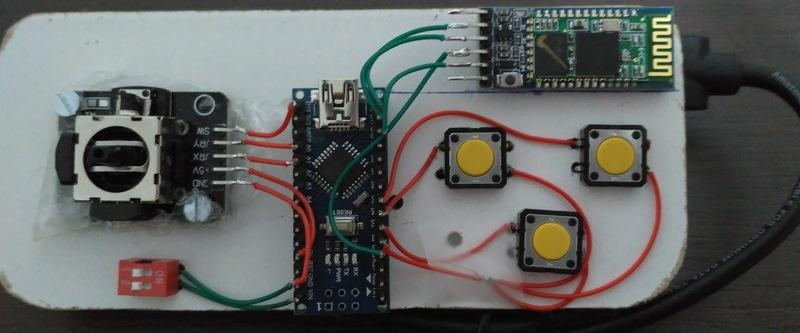
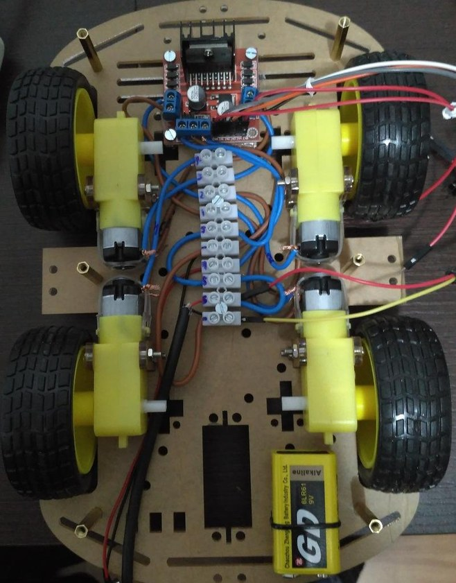
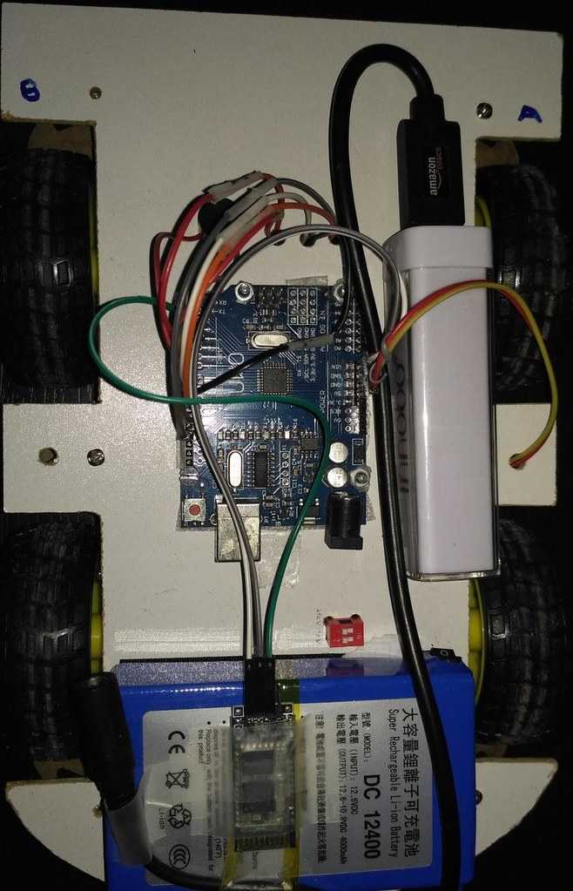

# RemoteControlled Car build with Arduino Uno/Nano and communication via Bluetooth

Software for Arduino Uno-based remote controlled car together with a Arduino Nano-based remote controlling and intercommunication via Bluetooth modules.

### Hardware components used for Remote Controlled Car

- Arduino [Uno](https://store.arduino.cc/arduino-uno-rev3) or compatible
- Battery or powerbank [ 5V,  +1450 mAh ] to power-up Arduino and its components (bluetooth module and speaker)
- Battery or powerbank [ 12V, +4000 mAh ] to power-up motors
- Bluetooth HC-06 slave module
- L298N Driver to control motors
- Buzzer / piezo speaker
- 4 DC motors + wheels
- Optional dip switch to turn on/off the car
- Car structure, up to your imagination :-)

### Hardware components used for Remote Controller

- Arduino [Nano](https://store.arduino.cc/arduino-nano) or compatible
- Battery or powerbank [ 5V,  +1450 mAh ]
- Bluetooth HC-05 master/slave module
- Joystick analog 2-Axis with button
- Three switch [buttons](https://www.arduino.cc/en/Tutorial/Switch)
- Optional dip switch to turn on/off the controller
- Controller structure, also up to your imagination

### Software structure

The software is splitted into [Abstraction Layers](https://en.wikipedia.org/wiki/Abstraction_layer) so the responsability of each layer are very limited and will make easier the growth and maintenance of the project in a Architectural point of view. Using a objected-oriented language such as C++ accepted by Arduino, makes the implementation closer to this approach.

**Dependencies**: Needs to have access to _Generic-Libraries/lib_ in this same repository
```
RemoteControlledCar
|--lib
|  |--RCC_Able
|  |  |- CAble.cpp
|  |  |- CAble.h
|  |--RCC_Controller
|  |  |- CController.cpp
|  |  |- CController.h
|--src
|  |- main.cpp
|  |- main.h
|- platformio.ini
Generic-Libraries
|--lib
|  |--Bluetooth_Lib
|  |--Common_Lib
|  |--Joystick_Lib
|  |--Melodies_Lib
|  |--Motors_Lib
|--external-libs
|  |--LowPower
```

### **TODO**: electrical schematics

### Final controller build


### Final car build


